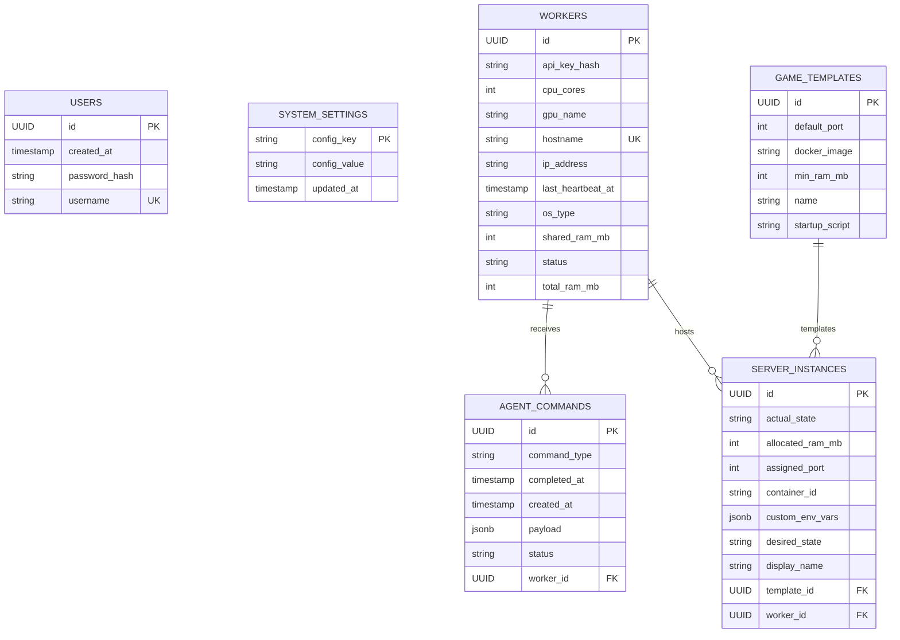

# Database Schema

LocalHive Master uses PostgreSQL as the application database. Flyway owns schema creation and migrations; Hibernate is configured with `ddl-auto=validate` and must not mutate the schema at runtime.

The current baseline migration is:

```text
localhive-backend/src/main/resources/db/migration/V1__baseline.sql
```

This baseline contains only the schema used by the current implementation. Task, Workload, metrics, and compute-grid tables are intentionally excluded until their domains are designed and implemented.

## Integration Tests

Database integration tests use Testcontainers PostgreSQL with the explicit `postgres:16.2-alpine` image. Docker Engine must be available when running the full Maven test suite.

No manually running LocalHive PostgreSQL instance is required for tests. Testcontainers provides a fresh PostgreSQL instance with a dynamic JDBC URL, Flyway initializes it from the migration set, and Hibernate validates the migrated schema with `ddl-auto=validate`.

## Current Tables

| Table | Purpose |
| --- | --- |
| `users` | First-time setup and admin authentication users. |
| `system_settings` | Key-value system configuration persisted by setup and application services. |
| `workers` | Registered LocalHive Agent workers and their current lifecycle state. |
| `agent_commands` | Commands queued for workers. |
| `game_templates` | Game server template definitions. |
| `server_instances` | Game server instances assigned to workers and templates. |

## Entity Relationship Diagram



## Constraints

| Table | Constraint |
| --- | --- |
| `users` | Primary key on `id`; unique `username`. |
| `system_settings` | Primary key on `config_key`. |
| `workers` | Primary key on `id`; unique `hostname`; `status` check for `PENDING`, `ACTIVE`, `PAUSED`, `OFFLINE`. |
| `agent_commands` | Primary key on `id`; foreign key to `workers(id)`; enum checks for `command_type` and `status`. |
| `game_templates` | Primary key on `id`. |
| `server_instances` | Primary key on `id`; foreign keys to `workers(id)` and `game_templates(id)`; enum checks for `desired_state` and `actual_state`. |
