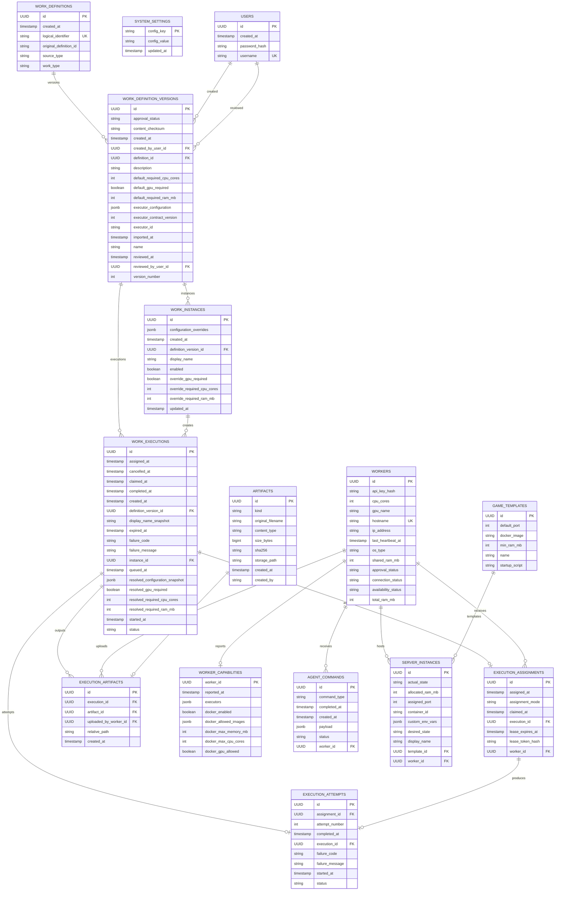

# Database Schema

LocalHive Master uses PostgreSQL as the application database. Flyway owns schema creation and migrations; Hibernate is configured with `ddl-auto=validate` and must not mutate the schema at runtime.

The current migration chain is:

```text
localhive-backend/src/main/resources/db/migration/V1__baseline.sql
localhive-backend/src/main/resources/db/migration/V2__split_worker_status.sql
localhive-backend/src/main/resources/db/migration/V3__add_work_definitions.sql
localhive-backend/src/main/resources/db/migration/V4__add_work_instances.sql
localhive-backend/src/main/resources/db/migration/V5__add_work_executions.sql
localhive-backend/src/main/resources/db/migration/V6__add_execution_attempts_and_assignments.sql
localhive-backend/src/main/resources/db/migration/V7__add_execution_assignment_lease.sql
localhive-backend/src/main/resources/db/migration/V8__add_artifacts.sql
localhive-backend/src/main/resources/db/migration/V9__add_execution_artifacts.sql
localhive-backend/src/main/resources/db/migration/V10__add_execution_display_name_snapshot.sql
localhive-backend/src/main/resources/db/migration/V11__add_worker_capabilities.sql
```

The baseline contains only the schema used by the current implementation. V2 migrates the previous combined Worker status into independent approval, connection, and availability dimensions. V3 adds Work Definition identity and immutable version persistence. V4 adds Work Instance persistence, configuration overrides, and relational resource defaults/overrides. V5 adds Work Execution lifecycle persistence with resolved configuration and resource snapshots. V6 adds one Master-side execution assignment per execution and one concrete execution attempt once an assigned execution starts running. Metrics, scheduler queues, and compute-grid runtime tables are intentionally excluded until those domains are designed and implemented.
V7 adds worker claim lease fields directly to `execution_assignments`. The raw lease token is never stored; only `lease_token_hash` is persisted. V7 does not add a scheduler, polling table, or separate lease table.
V8 adds generic artifact metadata for workspace packages. V9 adds execution output artifact persistence and links each `EXECUTION_OUTPUT` artifact to the `WorkExecution` and uploading worker. Metrics, scheduler queues, compute-grid runtime tables, output retention policy, and large artifact storage are intentionally excluded until those domains are designed and implemented.
V10 adds `work_executions.display_name_snapshot` for stable human-readable execution display. It is a required, nonblank `VARCHAR(255)` value and is documented in [Execution Display Metadata](execution-display-metadata.md).
V11 adds `worker_capabilities`, a latest-snapshot table for safe Agent capability metadata reported through worker heartbeat. It does not add capability history, scheduler behavior, Docker policy synchronization, or capability-aware worker selection.

## Integration Tests

Database integration tests use Testcontainers PostgreSQL with the explicit `postgres:16.2-alpine` image. Docker Engine must be available when running the full Maven test suite.

No manually running LocalHive PostgreSQL instance is required for tests. Testcontainers provides a fresh PostgreSQL instance with a dynamic JDBC URL, Flyway initializes it from the migration set, and Hibernate validates the migrated schema with `ddl-auto=validate`.

## Current Tables

| Table | Purpose |
| --- | --- |
| `users` | First-time setup and admin authentication users. |
| `system_settings` | Key-value system configuration persisted by setup and application services. |
| `workers` | Registered LocalHive Agent workers and their current approval, connection, and availability state. |
| `agent_commands` | Commands queued for workers. |
| `game_templates` | Game server template definitions. |
| `server_instances` | Game server instances assigned to workers and templates. |
| `work_definitions` | Stable logical identities for local or imported work definitions. |
| `work_definition_versions` | Immutable content versions for work definitions, including approval state. |
| `work_instances` | User-configured instances pinned to one immutable work definition version. |
| `work_executions` | Execution lifecycle records created from an approved definition version or enabled work instance. |
| `execution_assignments` | Master-side decision assigning one work execution to one eligible worker, including worker claim lease metadata. |
| `execution_attempts` | Concrete runtime attempt for an assigned execution; currently limited to attempt number `1`. |
| `artifacts` | Generic artifact metadata and internal storage path for workspace packages and execution outputs. |
| `execution_artifacts` | Links `EXECUTION_OUTPUT` artifacts to one work execution and the worker that uploaded them. |
| `worker_capabilities` | Latest safe capability snapshot reported by one worker. |

## Entity Relationship Diagram



## Constraints

| Table | Constraint |
| --- | --- |
| `users` | Primary key on `id`; unique `username`. |
| `system_settings` | Primary key on `config_key`. |
| `workers` | Primary key on `id`; unique `hostname`; `approval_status` check for `PENDING`, `APPROVED`; `connection_status` check for `ONLINE`, `OFFLINE`; `availability_status` check for `AVAILABLE`, `PAUSED`. |
| `agent_commands` | Primary key on `id`; foreign key to `workers(id)`; enum checks for `command_type` and `status`. |
| `game_templates` | Primary key on `id`. |
| `server_instances` | Primary key on `id`; foreign keys to `workers(id)` and `game_templates(id)`; enum checks for `desired_state` and `actual_state`. |
| `work_definitions` | Primary key on `id`; unique `logical_identifier`; check for lowercase logical identifier format; enum checks for `work_type` and `source_type`. |
| `work_definition_versions` | Primary key on `id`; unique `(definition_id, version_number)`; foreign keys to `work_definitions(id)` and creator/reviewer `users(id)`; checks for version number, executor contract version, JSON object executor configuration, non-negative default RAM/CPU resources, lowercase SHA-256 checksum, approval status, and approval review metadata. |
| `work_instances` | Primary key on `id`; foreign key to `work_definition_versions(id)`; checks for non-blank display name, JSON object configuration overrides, and non-negative nullable RAM/CPU resource overrides. |
| `work_executions` | Primary key on `id`; foreign keys to `work_definition_versions(id)` and optional `work_instances(id)`; checks for lifecycle status values, nonblank display name snapshot, JSON object resolved configuration snapshot, non-negative resolved RAM/CPU resources, lifecycle timestamp consistency, and failure fields for failed executions. |
| `execution_assignments` | Primary key on `id`; unique `execution_id`; foreign keys to `work_executions(id)` and `workers(id)`; check for assignment modes `AUTO`, `PREFER`, and `REQUIRE`; check that claim lease fields are either all null or all present; index on `worker_id`. |
| `execution_attempts` | Primary key on `id`; unique `execution_id`; unique `(execution_id, attempt_number)`; foreign keys to `work_executions(id)` and `execution_assignments(id)`; check that `attempt_number = 1`; checks for attempt statuses and terminal timestamp/failure-field consistency. |
| `artifacts` | Primary key on `id`; enum check for `WORKSPACE_PACKAGE` and `EXECUTION_OUTPUT`; checks for non-blank original filename and storage path, nullable non-blank content type, non-negative size, and 64-character SHA-256. |
| `execution_artifacts` | Primary key on `id`; unique `artifact_id`; foreign keys to `work_executions(id)`, `artifacts(id)`, and `workers(id)`; check for non-blank relative path. |
| `worker_capabilities` | Primary key on `worker_id`; foreign key to `workers(id)` with cascade delete; required `reported_at`; required JSONB executor array with bounded size; optional JSONB Docker allowed image array with bounded size; non-negative nullable Docker memory and CPU limits. |

## Worker State

Worker state is represented by three independent persisted dimensions:

| Column | Meaning | Current values |
| --- | --- | --- |
| `approval_status` | Whether the worker is allowed to participate in the cluster. | `PENDING`, `APPROVED` |
| `connection_status` | Whether Master currently considers the worker reachable. | `ONLINE`, `OFFLINE` |
| `availability_status` | Whether the worker is accepting new work. | `AVAILABLE`, `PAUSED` |

Flyway V2 migrates the previous combined `workers.status` column into these dimensions and then removes the old column. Future scheduler eligibility will use these independent dimensions, but scheduler behavior is not part of the current database schema.

## Work Definitions

Work Definition identity is split from versioned content:

| Table | Immutable content |
| --- | --- |
| `work_definitions` | Logical identifier, work type, source type, optional original imported definition id, and creation timestamp. |
| `work_definition_versions` | Version number, display name, description, executor id, executor contract version, executor configuration JSON, default resource request, and content checksum. |

Version numbers are assigned by Master per definition with a unique `(definition_id, version_number)` constraint. No `latestVersionNumber`, current-version pointer, or runtime Task table exists in the Work Definition schema.

`executor_configuration` is stored as PostgreSQL `JSONB` and must have a JSON object root. Empty objects are valid; arrays, scalars, and JSON null are rejected by application validation and the database check constraint.

The default resource request is relational: required RAM MiB, required CPU cores, and whether GPU is required. RAM and CPU default to `0` for historical V3 rows migrated through V4 and must remain non-negative.

The content checksum is a Master-generated lowercase hexadecimal SHA-256 string. It covers logical identifier, work type, version content fields, executor id, executor contract version, canonicalized executor configuration, and default resource request. It excludes database identifiers, definition id, version number, source metadata, approval metadata, timestamps, user ids, work instances, and instance overrides.

## Work Instances

Work Instances are user-configured instances pinned to a specific `work_definition_versions.id`. They do not point directly to `work_definitions`, and they are not automatically moved to newer versions. Any version change must be explicit and must remain inside the same Work Definition identity.

`configuration_overrides` is stored as PostgreSQL `JSONB` and must have a JSON object root. Effective configuration is resolved at runtime by recursively merging the pinned version's `executor_configuration` with the instance overrides. Objects merge recursively, arrays and scalar values replace the base value, and explicit JSON null is preserved as a value.

Resource overrides are stored relationally as nullable columns. A null override inherits the pinned version default, while a non-null RAM or CPU override must be greater than or equal to `0`. The `enabled` flag is only an administrative enable/disable setting; it is not a desired runtime state, assignment state, execution state, or scheduler lease.

## Work Executions

Work Executions are lifecycle records for actual execution requests. A record is created from either an approved `work_definition_versions.id` directly or from an enabled `work_instances.id`. Instance-created executions still store the pinned `definition_version_id` explicitly.

The `resolved_configuration_snapshot` column stores the effective JSONB object after applying one-off or instance configuration overrides. The resolved resource request is stored relationally as RAM MiB, CPU cores, and GPU-required columns. These snapshots are not updated when a Work Definition Version or Work Instance changes later.

The `display_name_snapshot` column stores a stable human-readable name captured when the execution is created. It is `VARCHAR(255)`, required, and nonblank after trimming. It is for UI, logs, dashboards, and history views only; it is not used as a path, filename, command argument, authorization input, assignment input, or lease input. Display metadata is documented in [Execution Display Metadata](execution-display-metadata.md).

Current lifecycle statuses are `QUEUED`, `ASSIGNED`, `CLAIMED`, `RUNNING`, `SUCCEEDED`, `FAILED`, `CANCELLED`, and `EXPIRED`. V5 stores timestamps for those lifecycle transitions and minimal failure fields (`failure_code`, `failure_message`) for failed executions.

## Execution Assignments and Attempts

Execution Assignment records the Master decision that one `work_executions.id` is assigned to one `workers.id`. The database enforces one assignment per execution with `uk_execution_assignments_execution_id`. Assignment modes are `AUTO`, `PREFER`, and `REQUIRE`. The current service layer creates an assignment only for a `QUEUED` execution and an eligible worker whose state is `APPROVED`, `ONLINE`, and `AVAILABLE`; the database stores the decision and foreign keys, while worker eligibility remains application logic.

V7 adds claim lease metadata to `execution_assignments`: `claimed_at`, `lease_expires_at`, and `lease_token_hash`. The claim lease fields are nullable for unclaimed assignments and must be all present after claim. Master returns the raw lease token to the worker once during claim and stores only the hash. M3 validates leases on worker report/renew requests and exposes a manual stale-claim expiry service method; it does not add a background scheduler or a separate lease table.

Execution Attempt records the concrete runtime attempt for an assigned execution. The current implementation creates an attempt only when lifecycle moves from `CLAIMED` to `RUNNING`. The schema intentionally enforces `attempt_number = 1`, unique `execution_id`, and unique `(execution_id, attempt_number)` because retry policy and multi-attempt execution are not implemented yet.

Current attempt statuses are `RUNNING`, `SUCCEEDED`, `FAILED`, and `CANCELLED`. Running attempts have no completion or failure fields. Succeeded and cancelled attempts require `completed_at` and have no failure fields. Failed attempts require `completed_at` and a non-blank `failure_code`; `failure_message` is optional but must be non-blank when present.

V6 does not introduce leases, claim tokens, scheduler ownership, REST polling, Agent transport changes, progress, logs, results, artifacts, executor registry, or retry policy. V7 introduces assignment lease fields only; Agent executor implementation, scheduler ownership, progress, logs, results, artifacts, executor registry, and retry policy remain out of scope for V7.

## Artifacts

V8 adds generic artifact metadata in `artifacts`. V9 adds `execution_artifacts`, which links each `EXECUTION_OUTPUT` artifact to one `work_executions.id` and the worker that uploaded it. Output artifacts are documented in [Output Artifacts](output-artifacts.md).

The internal `storage_path` column is not exposed by worker or admin DTOs. For execution outputs, Master stores content under a Master-generated path such as `.localhive-master/artifacts/<artifactId>/artifact`; the uploaded `relative_path` and original filename remain metadata only.

## Worker Capabilities

V11 adds `worker_capabilities` for the latest Agent capability report. The table stores one row per worker, keyed by `worker_id`, and deletes the row when the worker is deleted.

Executor capabilities and Docker allowed images are stored as PostgreSQL `JSONB`. Docker enabled state, max memory, max CPU, and GPU policy summary are stored as scalar columns. The table stores safe metadata only; it does not store API keys, Master URLs, local Agent config paths, full Agent config JSON, task history, workspace/output paths, lease tokens, `storagePath`, `dataRoot`, or physical paths.

See [Agent Capabilities](agent-capabilities.md) for the heartbeat contract and Admin Worker Detail response.
