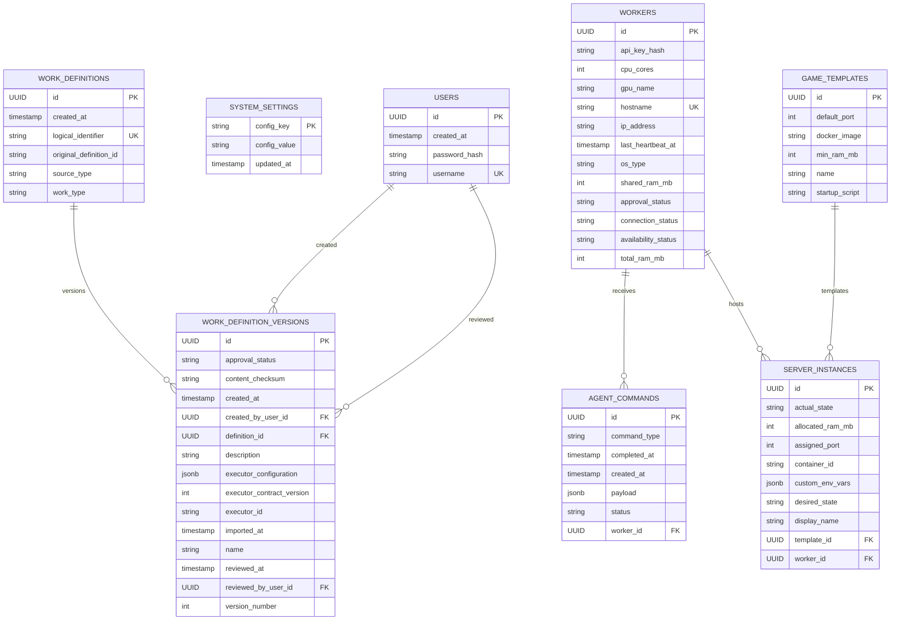

# Database Schema

LocalHive Master uses PostgreSQL as the application database. Flyway owns schema creation and migrations; Hibernate is configured with `ddl-auto=validate` and must not mutate the schema at runtime.

The current migration chain is:

```text
localhive-backend/src/main/resources/db/migration/V1__baseline.sql
localhive-backend/src/main/resources/db/migration/V2__split_worker_status.sql
localhive-backend/src/main/resources/db/migration/V3__add_work_definitions.sql
```

The baseline contains only the schema used by the current implementation. V2 migrates the previous combined Worker status into independent approval, connection, and availability dimensions. V3 adds Work Definition identity and immutable version persistence. Work execution, assignment, attempts, metrics, and compute-grid runtime tables are intentionally excluded until those domains are designed and implemented.

## Integration Tests

Database integration tests use Testcontainers PostgreSQL with the explicit `postgres:16.2-alpine` image. Docker Engine must be available when running the full Maven test suite.

No manually running LocalHive PostgreSQL instance is required for tests. Testcontainers provides a fresh PostgreSQL instance with a dynamic JDBC URL, Flyway initializes it from the migration set, and Hibernate validates the migrated schema with `ddl-auto=validate`.

## Current Tables

| Table | Purpose |
| --- | --- |
| `users` | First-time setup and admin authentication users. |
| `system_settings` | Key-value system configuration persisted by setup and application services. |
| `workers` | Registered LocalHive Agent workers and their current approval, connection, and availability state. |
| `agent_commands` | Commands queued for workers. |
| `game_templates` | Game server template definitions. |
| `server_instances` | Game server instances assigned to workers and templates. |
| `work_definitions` | Stable logical identities for local or imported work definitions. |
| `work_definition_versions` | Immutable content versions for work definitions, including approval state. |

## Entity Relationship Diagram



## Constraints

| Table | Constraint |
| --- | --- |
| `users` | Primary key on `id`; unique `username`. |
| `system_settings` | Primary key on `config_key`. |
| `workers` | Primary key on `id`; unique `hostname`; `approval_status` check for `PENDING`, `APPROVED`; `connection_status` check for `ONLINE`, `OFFLINE`; `availability_status` check for `AVAILABLE`, `PAUSED`. |
| `agent_commands` | Primary key on `id`; foreign key to `workers(id)`; enum checks for `command_type` and `status`. |
| `game_templates` | Primary key on `id`. |
| `server_instances` | Primary key on `id`; foreign keys to `workers(id)` and `game_templates(id)`; enum checks for `desired_state` and `actual_state`. |
| `work_definitions` | Primary key on `id`; unique `logical_identifier`; check for lowercase logical identifier format; enum checks for `work_type` and `source_type`. |
| `work_definition_versions` | Primary key on `id`; unique `(definition_id, version_number)`; foreign keys to `work_definitions(id)` and creator/reviewer `users(id)`; checks for version number, executor contract version, JSON object executor configuration, lowercase SHA-256 checksum, approval status, and approval review metadata. |

## Worker State

Worker state is represented by three independent persisted dimensions:

| Column | Meaning | Current values |
| --- | --- | --- |
| `approval_status` | Whether the worker is allowed to participate in the cluster. | `PENDING`, `APPROVED` |
| `connection_status` | Whether Master currently considers the worker reachable. | `ONLINE`, `OFFLINE` |
| `availability_status` | Whether the worker is accepting new work. | `AVAILABLE`, `PAUSED` |

Flyway V2 migrates the previous combined `workers.status` column into these dimensions and then removes the old column. Future scheduler eligibility will use these independent dimensions, but scheduler behavior is not part of the current database schema.

## Work Definitions

Work Definition identity is split from versioned content:

| Table | Immutable content |
| --- | --- |
| `work_definitions` | Logical identifier, work type, source type, optional original imported definition id, and creation timestamp. |
| `work_definition_versions` | Version number, display name, description, executor id, executor contract version, executor configuration JSON, and content checksum. |

Version numbers are assigned by Master per definition with a unique `(definition_id, version_number)` constraint. No `latestVersionNumber`, current-version pointer, Work Instance, Work Execution, Assignment, Attempt, or runtime Task table exists in this migration.

`executor_configuration` is stored as PostgreSQL `JSONB` and must have a JSON object root. Empty objects are valid; arrays, scalars, and JSON null are rejected by application validation and the database check constraint.

The content checksum is a Master-generated lowercase hexadecimal SHA-256 string. It covers logical identifier, work type, version content fields, executor id, executor contract version, and canonicalized executor configuration. It excludes database identifiers, definition id, version number, source metadata, approval metadata, timestamps, and user ids.
